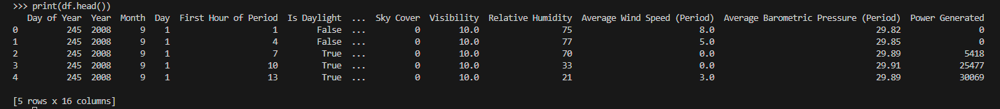
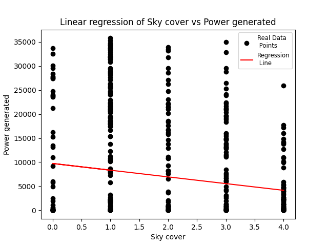
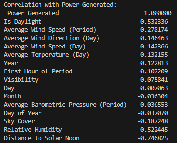

# Solar Data Science Project

## Introduction

The objective of this project is to use measurements to predict the output of a solar power system installed in Berkely, CA. I was always curious about how different conditions can affect the output of solar powered systems.

I was inspired to do this project simply because I find solar power and energy to be quite interesting. I would really like to in the future see a more efficient solar system be created because of the potential I feel that solar power has.

## Data Selection

The data has over 2,900 samples with 16 columns: 
'Day of Year','Year', 'Month', 'Day', 'First Hour of Period','Is Daylight', 'Distance to Solar Noon', 'Average Temperature (Day)','Average Wind Direction (Day)', 'Average Wind Speed (Day)', 'Sky Cover',   'Visibility', 'Relative Humidity', 'Average Wind Speed (Period)','Average Barometric Pressure (Period)', 'Power Generated'.

The purpose being a model created to predict the output of a solar power system. The dataset can be found online at [kaggle](https://www.kaggle.com/datasets/vipulgote4/solar-power-generation/)

Data Preview:

## Methods

Tools:
- NumPy, Pandas, Matplotlib, Scikit-learn
- GitHub
- VS Code as IDE

Methods used with Scikit-learn:
- Linear regression model

other method:
- correlation matrix(wanted an overview of the relationships between the weather factors and 'Power Generated')

"Linear regression analysis is used to predict the value of a variable based on the value of another variable. The variable you want to predict is called the dependent variable. The variable you are using to predict the other variable's value is called the independent variable." - [IBM](https://www.ibm.com/topics/linear-regression). 

I chose the linear regression model because I wanted to explore the relationship between weather conditions and the power generation of this solar power system based in California. 

I assumed with this method I would be able to find out the most important factors in generating the most power and being able to show that with a graph of the line of regression. 

I used the Scikit-learns linear regression model in this project. I used the LinearRegression class for model training and used functions like fit() and predict() to process the data.

## Results
Question 1: Does sky cover affect the amount of energy generated?

Question 2: Does wind speed affect the amount of energy generated?

VsPowerGeneratedRL.png)

Question 3: What is the most important weather condition for energy generation?

## Discussion
Using linear regression using an 80/20 testing method, I found that the data was not very accurate and very volatile. To measure accuracy I used mean squared error(mse) and R-squared, and with testing or numerous variables I found that the predictions were highly variable, where for questions 1 and 2 the mean squared error would be abnormally high, which leads to less accurate information, ex. for 'Sky Cover' the mean squared error was: 103869621.45973709. 

During this process I also came to know how complex these systems can be, where numerous factors all contribute to one another and in this case 'power generation'.

Overall I found that 'Sky Cover' and 'Wind Speed',from questions 1 and 2, were not significant predictors in 'Power Generation' of the solar power systems. However, in question 3 I found that three factors, 'Is Daylight' (0.53), 'Distance to Solar Noon' (-0.75), and 'Relative Humidity' (-0.52) show strong correlations with 'Power Generated'.

## Summary
This project tries to answer some questions about how weather factors can affect the power generated by a solar power system based in California. 

After looking at at various factors individually and graphing them with linear regression methods, I found that around only three weather factors strongly correlated with 'power generation'.

The linear regression models provided valuable insights into the relationships between specific weather variables and 'power generation'. Notably, factors such as 'Distance to Solar Noon,' 'Is Daylight,' and 'Relative Humidity' showed to be significant contributors to the observed variability in 'power generation'.

Further research in this topic would be to increase the understanding of these systems and how other factors relate to 'power generation' not only in California but all over the world.

## references

[1] [SolarPowerSystem-Kaggle](https://www.kaggle.com/datasets/vipulgote4/solar-power-generation/)

[2] [IBM-LinearRegression](https://www.ibm.com/topics/linear-regression)

[3] [RealPython-LinearRegression](https://realpython.com/linear-regression-in-python/)

[4] [RealPython-fStrings](https://realpython.com/python-f-strings/)

[5] [GeeksforGeeks-CorrelationMatrix](https://www.geeksforgeeks.org/create-a-correlation-matrix-using-python/)

